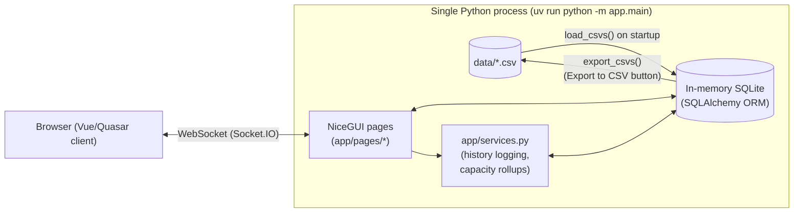

# Architecture

Architectural reference for the On My Plate app: the material components,
the decisions behind them, and the project structure. Complements
[data-model.md](data-model.md) (entity/table design), [standards.md](standards.md)
(code and design conventions, including the ECharts visualisation standard), and
[README.md](../README.md) (run instructions).

## System summary

A single-process **NiceGUI** web app. The UI, business logic, and database all run
in one Python process — there is no separate API layer or frontend build step.
State lives in an **in-memory SQLite** database for the lifetime of the process and
is seeded from, and can be exported back to, CSV files on disk.



## Material components

### 1. Web framework: NiceGUI

- The entire UI is server-rendered Python: each page function builds Vue/Quasar
  components imperatively (`ui.table`, `ui.dialog`, `ui.select`, …) and NiceGUI
  pushes DOM updates to the browser over a **Socket.IO WebSocket**.
- **Why it matters architecturally:** there is no REST/JSON API and no separate
  frontend codebase — a page's Python function *is* both the controller and the
  view. Business logic must therefore stay out of page functions (see
  [Layering](#layering) below) or it becomes untestable without a browser.
- Pages are registered as routes in [app/main.py](../app/main.py) via `@ui.page(...)`
  and each calls a `build()` function in `app/pages/<name>.py`.

### 2. Persistence: in-memory SQLite via SQLAlchemy

- `app/db.py` creates one engine for the process lifetime:
  `create_engine("sqlite://", poolclass=StaticPool, connect_args={"check_same_thread": False})`.
- **Why `StaticPool`:** SQLite's `sqlite://` (no file path) URI creates a *new,
  empty* database per connection by default. `StaticPool` forces SQLAlchemy to
  reuse a single underlying connection, which is what makes the in-memory DB
  durable across requests/threads for the process's lifetime.
- **Why `check_same_thread=False`:** NiceGUI/Starlette can service requests from
  different threads; the default SQLite driver forbids cross-thread use of a
  connection, so this is required alongside `StaticPool`.
- **Consequence:** all state is lost on process restart. This is intentional for
  v1 (see [CSV seeding](#3-csv-seed--export-round-trip)) but is the single
  biggest constraint to design around if this app needs to survive restarts,
  scale to multiple workers, or support concurrent users — none of which work
  with this setup today (see [Known constraints](#known-constraints--future-decisions)).
- ORM models are declared in [app/models.py](../app/models.py) using SQLAlchemy 2.0's
  typed `Mapped[...]` / `mapped_column` style, one class per table.

### 3. CSV seed / export round-trip

- On every process start, `bootstrap()` in `app/main.py` calls `init_db()`
  (creates all tables) then `load_csvs()` (`app/seed.py`), which reads each
  `data/*.csv` file and inserts rows.
- The header row of each CSV must match the corresponding model's column names;
  `_coerce()` converts CSV strings to the right Python type by inspecting each
  column's SQLAlchemy type (`Boolean`, `Integer`, `Float`, `Date`, `DateTime`).
- Load order matters and is hardcoded in `CSV_TABLES` (parents before children,
  e.g. `team_member` before `task`) so foreign keys resolve.
- **Export to CSV** (a header button, wired in `app/pages/layout.py`) calls
  `export_csvs()`, which queries every table and overwrites the same CSV files —
  this is the *only* way changes made in the UI outlive a process restart.
- **Why this design:** it gives the app deterministic, version-controllable seed
  data (useful for demos and tests) without standing up a real database server.
  The trade-off is manual, explicit persistence (a user must click Export) rather
  than durability by default.

### 4. Data model

Three-level work hierarchy — **strategy item → workstream → task** — plus a
capacity-planning layer and an audit trail. Full field-level design is in
[data-model.md](data-model.md); the components below are the parts that shape
the app's architecture:

- **`estimate_history`** is an append-only, polymorphic log (`entity_type` +
  `entity_id`, covering `task`/`workstream`/`strategy_item`). It's written
  through one shared helper, `record_status_change()` / `record_task_change()`
  in [app/services.py](../app/services.py), so every entity logs status/estimate
  changes the same way. Currently only the Task page calls it — workstream and
  strategy item edits (both on the Workstreams page) do not yet log history
  (see [Known constraints](#known-constraints--future-decisions)).
- **Two-level capacity allocation:** `team_member_capacity` (availability per
  person per `capacity_period`) and `workstream_allocation` (planned effort per
  person per workstream per period) are separate from task-level
  `estimated_effort_weeks`. `capacity_summary()` in `app/services.py` rolls both
  up per person and compares them against the sum of *open* (not
  done/cancelled) task estimates, flagging over-allocation. This comparison is
  **not period-aware** today — it sums availability/allocation across all
  periods and compares against total open task effort, because task effort
  isn't yet phased per period (a noted gap, see below).
- **Units:** all effort/capacity figures are **person-weeks** (not hours or
  points) — a deliberate choice made early in the project to keep task effort,
  workstream allocation, and member availability directly comparable without a
  conversion step.

### 5. Layering

```
app/pages/*.py    UI: builds NiceGUI components, wires callbacks, calls services/db directly
app/services.py    Business logic: history logging, capacity rollups (DB-session in, plain dicts/ORM objects out)
app/models.py      Schema: SQLAlchemy ORM models, status vocabularies
app/db.py          Engine/session lifecycle
app/seed.py        CSV <-> DB translation
```

- `app/pages/common.py` holds small cross-page helpers (date parsing, FK
  dropdown option lists, the shared status colour map/badge slot) to avoid
  duplicating query logic across the page modules.
- **Why services are separate from pages:** `app/services.py` has no NiceGUI
  imports, so it can be (and is) unit-tested directly against a real in-memory
  DB fixture without a browser or event loop — see `tests/test_capacity.py` and
  `tests/test_crud.py`. Pages are not unit-tested; they're verified manually via
  the browser preview tool.
- Each CRUD entity follows the same internal pattern: `_load_rows()` (query +
  flatten to dicts for `ui.table`), a `_save_*()` (upsert), and an
  `open_*_form()` (a `ui.dialog` acting as both add and edit). `app/pages/workstreams.py`
  hosts two such entities on one page — strategy items as cards, each with its
  workstreams in a nested `ui.table` underneath — since the two are meant to be
  browsed together (see the "Combined pages" note below).

### 6. Session-per-call data access

- There is no long-lived request-scoped session. `app/db.py`'s `get_session()`
  is a context manager opened fresh for each logical operation (a page load, a
  save, an export) and committed/closed immediately:
  `with get_session() as session: ...`.
- **Why:** NiceGUI callbacks are plain Python closures, not framework-managed
  request handlers, so there's no natural hook to open/close a session per HTTP
  request the way a typical web framework middleware would. Short-lived,
  explicit sessions avoid stale/detached-object bugs at the cost of re-querying
  option lists (e.g. `member_options()`) on every dialog open.

### 7. Configurable theme, kept separate from semantic colours

- `app/pages/theme.py` holds a small registry of named `Palette`s (`primary`,
  `secondary`, `accent`, `negative`, `background`), applied once per page load
  via `apply_theme()` — called from `layout.header()`, so every page picks it
  up automatically. Switching the active look is a one-line change
  (`ACTIVE_PALETTE = "..."` in that file) plus a restart; there is
  deliberately no in-app switcher UI or persisted user preference.
- **Why kept separate from `STATUS_COLORS`/`PRIORITY_COLORS`:** the theme
  covers non-semantic UI chrome (header/nav bar, buttons, page background).
  Status and priority dot colours carry meaning (red = blocked, green = done)
  that must stay stable regardless of which brand palette is active — see
  [data-model.md](data-model.md) and [standards.md](standards.md)'s status
  colour conventions. Card backgrounds are left at Quasar's plain white for
  the same reason in reverse: giving cards the same tone as the page
  background (e.g. `"deep_space"`'s mint-cream) would erase the contrast that
  makes them read as distinct surfaces.
- **`"classic"`** is not "leave everything unset" — it's the actual Quasar
  stock hex values (`primary: #1976D2`, etc.) this app rendered with before
  `theme.py` existed, captured verbatim. That's what makes switching back a
  faithful revert rather than "whatever Quasar's own defaults happen to be
  in some future version".
- Applying the palette needs two different mechanisms: `ui.colors(...)` for
  the four Quasar theme roles (it sets `--q-primary` etc. as CSS custom
  properties that Quasar components already reference), and a plain
  `ui.query("body").style("background-color: ...")` for the page background,
  since Quasar's colour roles don't cover that. The background line doesn't
  use `!important` — `ui.query().style()` applies it via the browser's
  2-argument `CSSStyleDeclaration.setProperty(key, value)`, and embedding
  `!important` inside that value string (rather than passing it as
  `setProperty`'s separate 3rd argument) is invalid and silently drops the
  *entire* declaration, not just the priority — this cost a full round of
  "the theme isn't applying at all" debugging when `theme.py` was first
  written, so plain inline style it stays (it already out-specifies the
  body's default unset background without needing `!important` anyway).

### 8. Tooling and dependency management

- **uv** manages the Python environment and dependencies (`pyproject.toml`,
  `uv.lock`); Python is pinned to **3.12** via `.python-version`.
- Runtime dependencies: `nicegui>=3.16.0`, `sqlalchemy>=2.0.52`. Dev-only:
  `pytest>=9.1.1`. No pandas, no ORM migration tool (Alembic) — schema is
  created fresh via `Base.metadata.create_all()` on every start, which is only
  viable because the DB is in-memory and reseeded each run.
- `.claude/launch.json` defines how the app is previewed during development
  (`uv run python -m app.main` on port 8080) — this is tooling configuration,
  not part of the shipped app.

## Project structure

```
.
├── app/
│   ├── main.py            # NiceGUI entrypoint: bootstrap() seeds DB, @ui.page routes
│   ├── db.py               # Engine (StaticPool, in-memory SQLite) + get_session()
│   ├── models.py            # SQLAlchemy ORM models + status vocabularies
│   ├── seed.py               # CSV -> DB (load_csvs) and DB -> CSV (export_csvs)
│   ├── services.py            # estimate_history logging, capacity/KPI/allocation rollups
│   └── pages/
│       ├── layout.py           # Shared header/nav (app name + icon) + Export-to-CSV action
│       ├── theme.py             # Configurable UI palette (header/buttons/background); see "7." above
│       ├── common.py            # Date parsing, FK dropdown helpers, shared colour maps/badge slots
│       ├── home.py               # Landing page: KPI row, team capacity chart, workstream x person grid
│       ├── people.py              # Team member CRUD + per-person timeline + weekly allocation heatmap
│       ├── workstreams.py          # Strategy items (cards) with their workstreams nested underneath,
│       │                           # incl. per-workstream timeline; combined page (see note below)
│       └── tasks.py                  # Task CRUD (incl. priority) + filters (multi-select status) + history viewer
├── data/                                # seed CSVs, one per table, loaded in FK-safe order
│   ├── people.csv, strategy_items.csv, workstreams.csv, tasks.csv
│   ├── capacity_period.csv, team_member_capacity.csv, workstream_allocation.csv
│   └── estimate_history.csv              # seeded with sample entries, including estimate revisions
├── docs/
│   ├── data-model.md            # Entity/field-level data model reference
│   ├── standards.md              # Code/design conventions, incl. the ECharts visualisation rule
│   └── architecture.md            # This file
├── tests/                                # one file per service function / chart builder, roughly;
│   │                                      # not exhaustively listed here — see tests/ directly
│   ├── conftest.py               # Fresh in-memory DB fixture per test
│   ├── test_seed.py               # CSV <-> DB round-trip
│   ├── test_crud.py                # estimate_history logging on task changes
│   ├── test_capacity.py             # capacity_summary()/kpi_summary() rollups
│   └── test_theme.py                  # palette registry: valid hex, "classic" is a faithful snapshot
├── pyproject.toml / uv.lock        # uv-managed deps, Python >=3.12
├── .python-version                  # pinned to 3.12
├── .claude/launch.json               # dev-server preview config (not shipped)
└── README.md                          # run/test instructions
```

**Combined pages:** Strategy items and workstreams share one page/route
(`app/pages/workstreams.py`, `/workstreams`) rather than two, since a
workstream is only ever browsed in the context of its strategy item — each
strategy item renders as a card with its workstreams in a nested table
underneath, plus an "Unassigned" card for workstreams with no
`strategy_item_id`. The page (and its route/nav label) is named after
workstreams, not strategy items, since workstreams are the unit a user
actually browses day to day; strategy items are the grouping context. There
used to be a standalone `/capacity` page (tabbed CRUD for `capacity_period` /
`team_member_capacity` / `workstream_allocation`); it was removed, but the
tables themselves, their seed CSVs, and every service function that reads them
(`capacity_summary()`, the Home KPI row) are unaffected — new rows for those
three tables can currently only be added by editing the CSVs before startup.

## Request / lifecycle flow

1. **Startup:** `app/main.py` calls `bootstrap()` once at import time (not inside
   `ui.run()`), which creates all tables and loads every `data/*.csv` into the
   in-memory DB. This happens once per process, before any page is served.
2. **Page load:** NiceGUI routes `/`, `/people`, `/workstreams`, `/tasks` each to
   a `build()` function that opens its own session(s), queries rows, and
   renders `ui.table`/`ui.dialog`/`ui.echart` components.
3. **Mutation:** a dialog's Save handler opens a fresh session, upserts the ORM
   object, and — for tasks — calls `record_task_change()` if status or estimated
   dates changed, appending an `estimate_history` row in the same session/commit.
4. **Export:** the header's "Export to CSV" button opens one session, queries
   every table (in the same parent-before-child order used for loading), and
   overwrites `data/*.csv`, including a new `estimate_history.csv` if history
   rows exist.

## Known constraints & future decisions

These aren't bugs — they're scope boundaries from v1 that the next architectural
decision should account for:

- **No persistence across restarts** without an explicit Export. A move to a
  file-based SQLite DB (or a server DB) would remove the CSV round-trip's role
  as the durability mechanism and is the most consequential change on the
  horizon.
- **Single process, no auth, no multi-user isolation.** Every browser tab shares
  the same in-memory DB and there's no session/user concept — fine for a local
  planning tool, not for concurrent multi-user use.
- **Task effort is not period-phased.** `estimated_effort_weeks` is a single
  total per task, so `capacity_summary()` compares period-summed availability
  against all-time open-task effort rather than a true per-period view. A
  `task_allocation(task_id, period_id, weeks)` table (mirroring
  `workstream_allocation`) would close this gap.
- **History logging is task-only.** `record_status_change()` is entity-agnostic
  by design, but only `app/pages/tasks.py` currently calls it — workstream and
  strategy-item status changes aren't yet logged.
- **No schema migrations.** `create_all()` is safe today only because the DB is
  rebuilt from scratch every run; introducing persistent storage will require a
  migration strategy (e.g. Alembic).
