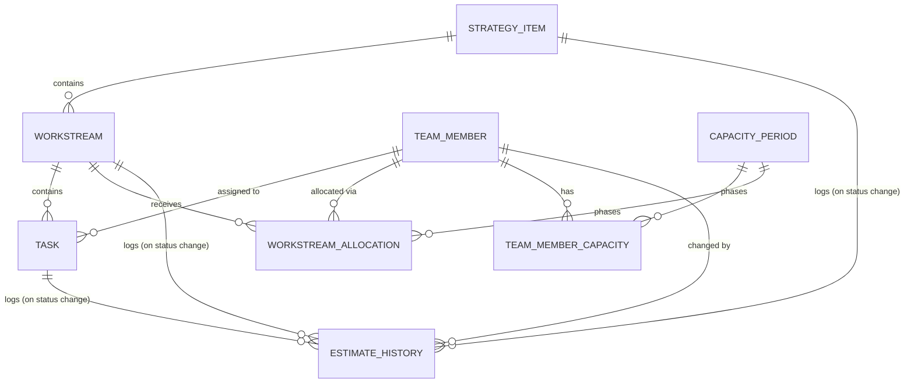

# On My Plate — Data Model

Draft data model for the team capacity estimation application. This document is the
source of truth for generating database schemas (DDL / ORM models) later on.

## Overview

The application estimates team capacity against planned work. Work is organized in a
three-level hierarchy, capacity is allocated top-down then reconciled bottom-up, and
every status change is captured as a time-series snapshot of the estimated dates.

- **Hierarchy:** `strategy_item` → `workstream` → `task`
- **Assignment:** each `task` is assigned to exactly one `team_member`
- **Two-level capacity:** capacity is first allocated at the **workstream** level, then
  broken down at the **task** level. Comparing the two (and both against a member's
  baseline availability) surfaces over-/under-allocation.
- **Estimate units:** effort and capacity are measured in **person-weeks**. Estimated
  start/end are stored as calendar **dates**; their span expresses duration in weeks.
- **Time series:** whenever an entity's status changes, a row is appended to
  `estimate_history` capturing the status and the estimated dates as they stood at that
  moment, plus a narrative status update.

## Entity-Relationship Diagram

## Core Hierarchy

### strategy_item

Top-level strategic initiative.

| field | type | notes |
|---|---|---|
| id | PK | |
| name | text | |
| description | text | |
| priority | int / enum | for ranking |
| status | enum | `proposed, active, on_hold, done, cancelled` |
| owner_id | FK → team_member | optional |
| target_start | date | current value; full history in `estimate_history` |
| target_end | date | current value; full history in `estimate_history` |
| created_at | timestamp | |
| updated_at | timestamp | |

### workstream

A stream of work under a strategy item; the level at which capacity is first allocated.

| field | type | notes |
|---|---|---|
| id | PK | |
| strategy_item_id | FK → strategy_item | |
| name | text | |
| description | text | |
| status | enum | `not_started, in_progress, blocked, done, cancelled` |
| lead_id | FK → team_member | optional |
| estimated_start | date | latest snapshot; full history in `estimate_history` |
| estimated_end | date | latest snapshot; full history in `estimate_history` |
| created_at | timestamp | |
| updated_at | timestamp | |

### task

A unit of work under a workstream, assigned to one team member. Holds the task-level
capacity estimate.

| field | type | notes |
|---|---|---|
| id | PK | |
| workstream_id | FK → workstream | |
| assignee_id | FK → team_member | each task belongs to exactly one member |
| name | text | |
| description | text | |
| status | enum | `not_started, in_progress, blocked, done, cancelled` |
| priority | enum | `low, medium, high`; defaults to `medium` |
| estimated_effort_weeks | numeric | task-level capacity estimate, in person-weeks |
| estimated_start | date | latest snapshot; full history in `estimate_history` |
| estimated_end | date | latest snapshot; full history in `estimate_history` |
| actual_start | date | nullable, filled as work happens |
| actual_end | date | nullable, filled as work happens |
| created_at | timestamp | |
| updated_at | timestamp | |

## Team & Capacity

A member's baseline availability is time-phased into **periods**, consumed top-down at
the **workstream** level, and reconciled bottom-up against **task** effort.

### team_member

| field | type | notes |
|---|---|---|
| id | PK | |
| name | text | |
| role | text | |
| default_weekly_hours | numeric | baseline FTE reference |
| active | bool | |
| active_from | date | when this member became active (nullable) |
| created_at | timestamp | |
| updated_at | timestamp | |

### capacity_period

The time buckets planned against (week / sprint / month).

| field | type | notes |
|---|---|---|
| id | PK | |
| name | text | e.g. "2026-W35" |
| start_date | date | |
| end_date | date | |

### team_member_capacity

Actual availability per member per period (handles PTO, part-time, ramp).

| field | type | notes |
|---|---|---|
| id | PK | |
| team_member_id | FK → team_member | |
| period_id | FK → capacity_period | |
| available_weeks | numeric | fraction of the period available; `1.0` = full week, `0.6` = part-time/PTO |

### workstream_allocation

Capacity **first assigned at the workstream level**. Time-phased so allocation can vary
across periods.

| field | type | notes |
|---|---|---|
| id | PK | |
| workstream_id | FK → workstream | |
| team_member_id | FK → team_member | |
| period_id | FK → capacity_period, nullable | null for a standing `allocation_pct` row (see below) |
| allocated_weeks | numeric | person-weeks allocated to this workstream, for a given period |
| allocation_pct | numeric | % of the person's time standing-allocated to this workstream, independent of period; a person's rows should sum to ~100 across their workstreams |

Both allocation units live on the same table but represent two independent, non-period
and period-scoped views: `allocated_weeks` rows carry a `period_id` and are the
time-phased top-down plan; `allocation_pct` rows always have `period_id = NULL` and
represent each person's current standing split of time across workstreams (e.g. "50% on
Guided Setup Flow, 50% on In-App Checklist"), edited from the People page and
visualised on the Home page. A person's `allocation_pct` rows summing to more than 100
means they're over-allocated; less than 100 means they have spare capacity.

> **Task-level allocation** is captured by the task's `assignee_id` +
> `estimated_effort_weeks`. Rolling up task effort per member per period and comparing it
> against `workstream_allocation` and `team_member_capacity` produces the estimate-vs-capacity view.

## Status-Driven Time Series

### estimate_history

Append-only log. A row is written each time an entity's status changes, capturing the
estimated dates as they stood at that moment plus a narrative update. The live
`estimated_start`/`estimated_end` fields on each entity are a denormalized copy of the
most recent row for fast reads.

| field | type | notes |
|---|---|---|
| id | PK | |
| entity_type | enum | `strategy_item, workstream, task` |
| entity_id | int | polymorphic reference to the entity's id |
| previous_status | enum | nullable (first entry) |
| status | enum | status *after* the change |
| estimated_start | date | snapshot at change time |
| estimated_end | date | snapshot at change time |
| status_update | text | narrative update entered at this change — progress, blockers, why the estimate moved |
| changed_by_id | FK → team_member | who triggered the change |
| changed_at | timestamp | order by this to reconstruct the series |
| note | text | optional short reason/tag |

Query `estimate_history` filtered by `entity_type` + `entity_id`, ordered by `changed_at`,
to reconstruct the full trajectory of an entity's status and estimated dates over time.

## Open Decisions

Items to confirm before generating concrete schemas:

1. **History trigger scope** — currently logs on status change. Estimates are often
   revised without a status change; recommendation is to also log on any estimate change
   (each row keeps `status`, so status-only transitions remain filterable).
2. **Task-level time-phasing** — task effort is a single `estimated_effort_weeks` total.
   If a task spans multiple periods and effort must be spread across them, add a
   `task_allocation(task_id, period_id, weeks)` table mirroring `workstream_allocation`.
3. **Polymorphic history vs. per-entity tables** — `estimate_history` is polymorphic
   (one place to query, no DB-level FK integrity). Alternative: separate
   `task_history` / `workstream_history` / `strategy_item_history` tables.
4. **Target stack** — SQL dialect (Postgres, etc.) and ORM (Prisma, SQLAlchemy, Django,
   …) for schema generation.
